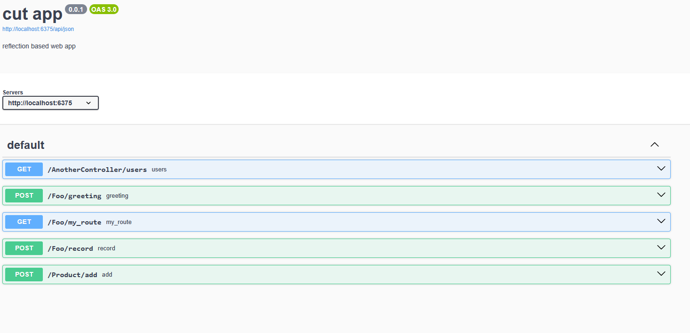

# 🔪 cut - bleeding edge c++ web framework using reflection and coroutines

## Motivating example
```cpp
class Greeting : public cut::web::ControllerBase
{
public:
    [[=cut::web::Get]]
    auto simple() -> cut::coro::Task<cut::web::Response>
    {
        co_return cut::web::Ok("hello world");
    }
};

auto main() -> int
{
    auto app = cut::web::App<Greeting>{};
    app.run();
}

```

## Why?
I wanted to play around with [reflection](https://www.open-std.org/jtc1/sc22/wg21/docs/papers/2025/p2996r12.html) - the hot new C++26 feature. Also I've always liked the user facing simplicity of ASP.net MVC apps, so I thought I'd try and implement it.

This project includes reflection based implementations for:
- HTTP web server (routes discovered via controller/member name)
- Dependency injection (automatic object creation with arguments resolved to derived classes)
- JSON serialisation 
- Database ORM

## A more compelling example
```cpp

struct ProductModel
{
    [[=cut::db::Id]]
    std::uint32_t id = 0;
    std::string name;
    std::uint32_t stock_count;
};

struct ProductCreateRequest
{
    std::string name;
};

struct ProductSuccess
{
    std::string name;
};

class Product : public cut::web::ControllerBase
{
  public:
    Product(cut::db::Db *db)
        : db_(db)
    {
    }

    [[=cut::web::Post]]
    auto add(ProductCreateRequest product_create_request) -> cut::coro::Task<cut::web::Response>
    {
        auto db_runner = cut::db::DbRunner{db_};
        co_await db_runner.insert(ProductModel{
            .name = product_create_request.name,
            .stock_count = 0
        });

        co_return cut::web::Created(ProductSuccess{.name = product_create_request.name});
    }

  private:
    cut::db::Db *db_;
};

auto main() -> int
{
    auto app = cut::web::App<Product>{};
    app.run();
}
```

Note in the above that you do not have to:
- Create the controller or worry about creating its dependencies (an sqlite3 implementation of `Db` is automatically created for you)
- Parsing the request json into a `ProductCreateRequest`, if the fields are there then it will construct the object for you
- Write any SQL, the database table is automatically created for you based on the struct `ProductModel`
- Serialise the response to JSON, you can return any object and it will get converted for you

## Anything else?
It has a hard coded route for `/api/json` which produces an OpenAPI standard json file (via reflection), which you can then shove into swagger:


## How does it work?
The code is pretty well commented, so feel free to have a read. You can always reach out to me on [discord](https://discord.gg/9FkkMgXSUV) (:

## How do I build it?
Carefully. You need build the P2996 fork of clang, here's what I did:
```bash
git clone --depth 1 --branch p2996 https://github.com/bloomberg/clang-p2996.git
cd ./clang-p2996/
make -S llvm -B build -DCMAKE_BUILD_TYPE=Release -DLLVM_ENABLE_PROJECTS='clang;llvm' -DLLVM_ENABLE_RUNTIMES=all -DCMAKE_INSTALL_PREFIX=/opt/clang/reflection -G Ninja
ninja -C build
sudo ninja -C build install
```

I've then got a Makefile you can use to build this
